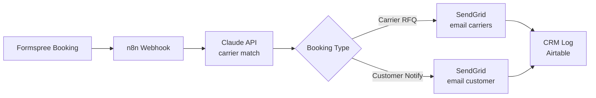

# Proposal: Formspree → Claude API → Two-Path Email Automation

**Job:** Formspree → Claude API → Two-Path Email Automation (Carriers OR Customer)
**Client:** Houston auto-transport broker, 223 jobs, 4.7 rating
**Date:** 2026-06-08
**Bid:** $350

---

## Hook

Built the carrier-matching agent from your spec. It reads pickup and delivery ZIPs, reasons over your carrier list with no pre-mapping, and returns matched carrier names and emails as JSON for both booking paths.

**Demo:** [STREAMLIT_LINK]
**Screenshots:** [ATTACHED]

---

## What the Demo Does

The Streamlit demo takes three inputs: pickup ZIP, delivery ZIP, and vehicle type. Claude Haiku reads those against the carrier CSV and returns matched carriers with reasoning. The UI then renders either the carrier RFQ email or the customer carrier-list email, ready to send.

No hardcoded routing rules. When you add carriers to the CSV, the matching updates automatically.

**Demo runtime:** under 5 seconds per match.

---

## Architecture

```
Trigger:     Formspree booking form submission
Input:       Pickup ZIP, delivery ZIP, vehicle type, booking type (carrier or customer)
Processing:  n8n webhook receives → Claude API reads carrier CSV + route → returns matched carriers as JSON
Output:      SendGrid sends carrier RFQ email OR customer carrier-list email
Verify:      Booking logged to CRM (Airtable), email delivery confirmed via SendGrid webhook
```



---

## Tech Stack and Timeline

**Stack:** Claude Haiku (carrier reasoning), n8n (orchestration), Python (carrier CSV parsing), SendGrid (email delivery), Airtable (CRM log)

**Timeline:**
- Day 1-2: Connect Formspree webhook to n8n, wire Claude API with your carrier CSV
- Day 3: SendGrid email templates, both branches tested end-to-end
- Day 4: CRM logging, error handling (missing ZIP, no matching carriers)
- Day 5: Live testing on real bookings, handoff

**Total: 4-5 days from kickoff**

---

## Pricing

**Phase 1 (this project):** $350 fixed
- Formspree → n8n → Claude → SendGrid, both email branches
- Carrier CSV integration (your 800+ carrier list)
- CRM logging to Airtable
- Error handling + retries

**Phase 2 options (contract-to-hire expansion):**
- Carrier rate tracking (scrape/email parse → update carrier records)
- Customer booking status automation (auto-updates via email)
- Multi-channel dispatch (SMS via Twilio alongside email)
- Monthly maintenance retainer: $400/month
