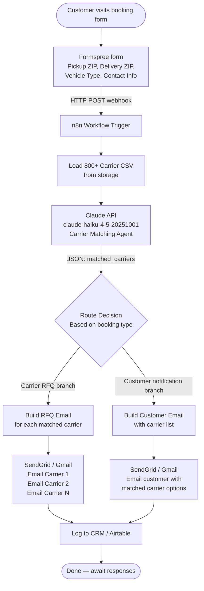

# Workflow: Formspree → Claude API → Two-Path Email Automation

## Mermaid Diagram

## Step-by-Step

| Step | Actor | Action |
|------|-------|--------|
| 1 | Customer | Fills Formspree booking form (pickup ZIP, delivery ZIP, vehicle type) |
| 2 | Formspree | POSTs form data as JSON to n8n webhook URL |
| 3 | n8n | Receives webhook, loads carrier CSV from storage |
| 4 | Claude API | Reads carrier list + route, returns matched carriers as JSON |
| 5 | n8n | Checks booking type (carrier RFQ vs. customer notification) |
| 6a | SendGrid | If carrier RFQ: sends RFQ email to each matched carrier |
| 6b | SendGrid | If customer notification: sends carrier list email to customer |
| 7 | Airtable/CRM | Logs booking, matched carriers, and email send status |

## Email Branches

### Branch A — Carrier RFQ
**Trigger:** Dispatch team wants competitive quotes before committing to customer  
**Recipients:** All matched carriers (typically 3-8 per route)  
**Content:** Shipment details, request for rate + ETA, 24-hour deadline

### Branch B — Customer Notification
**Trigger:** Customer self-service booking, carriers already pre-vetted  
**Recipients:** Customer (single email)  
**Content:** Matched carrier names, contact info, next steps

## Claude Prompt Strategy

The carrier-matching agent receives:
- Route context: pickup state (derived from ZIP), delivery state, vehicle type
- Full carrier CSV as context window content
- Instructions to return strict JSON only

Claude evaluates each carrier against:
1. `regions` field contains both origin AND destination state
2. `vehicle_types` field includes the requested vehicle type
3. Ranking by best coverage + notes quality
